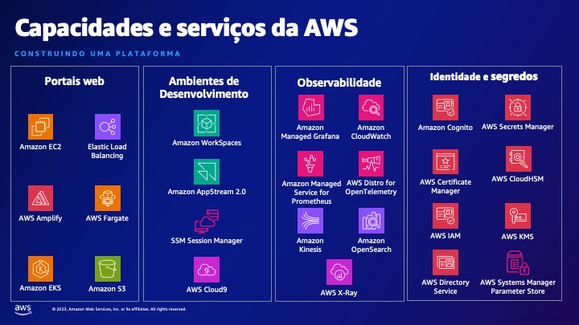

# Plataforma de Desenvolvimento Interna / Engenharia de Plataforma

## Referências

* CNCF Platforms White Paper - https://tag-app-delivery.cncf.io/whitepapers/platforms/
* Well Architected Framework - https://go.aws/453HqMg
* PlatformCon 2023 - https://platformcon.com/talks
* Backstage on AWS - https://bit.ly/aws-backstage
* Internal Development Platform - https://internaldeveloperplatform.org/

## Aprenda

* Skill Builder - https://skillbuilder.aws

## Projetos

* Orchestrate Platforms and Applicationson (OPA) - https://opaonaws.io/
* Backstage - https://backstage.io/
* Crossplane - https://www.crossplane.io/

## Conecte-se

* David Reis - https://www.linkedin.com/in/davidreisjr/
* Pedro Rosinholi - https://www.linkedin.com/in/pedrorosinholi/
* Leonardo Piedade - https://www.linkedin.com/in/leoap/
* Ana Mantovan - https://www.linkedin.com/in/anamantovan/
* Rafael Leonardo - https://www.linkedin.com/in/rafael-leonardo-cruz/

## Serviços da AWS

